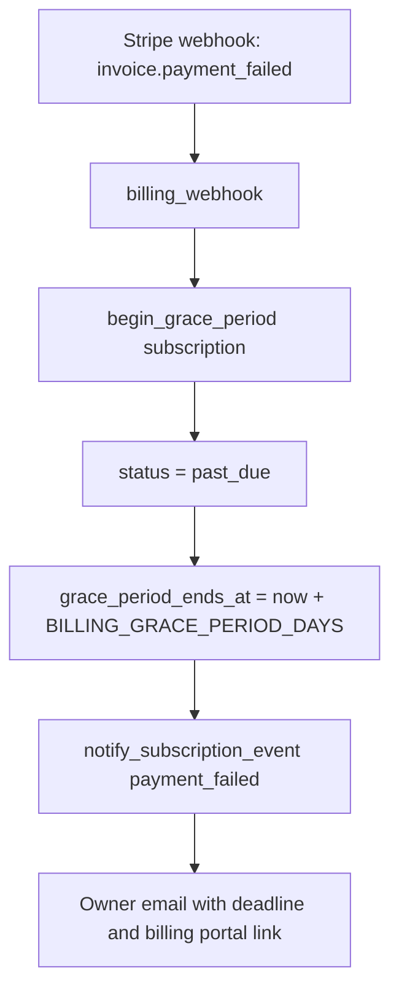
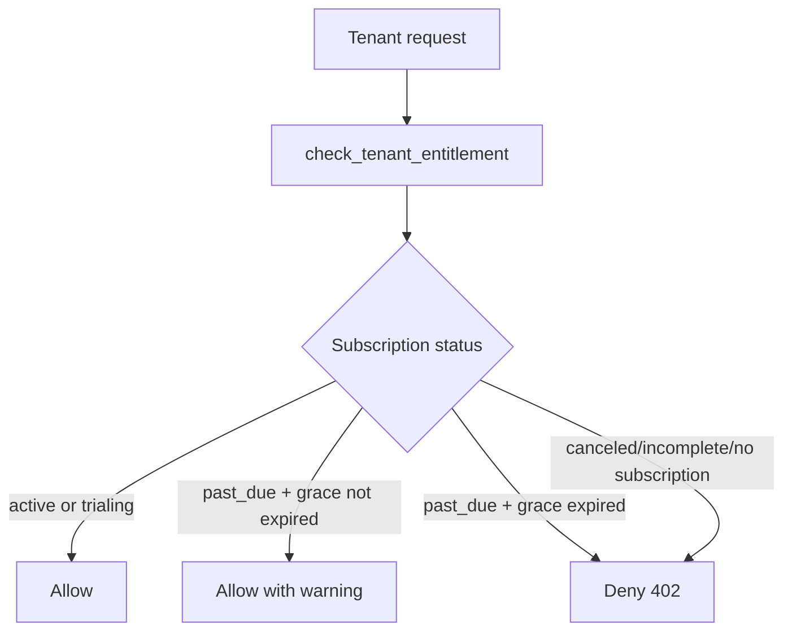
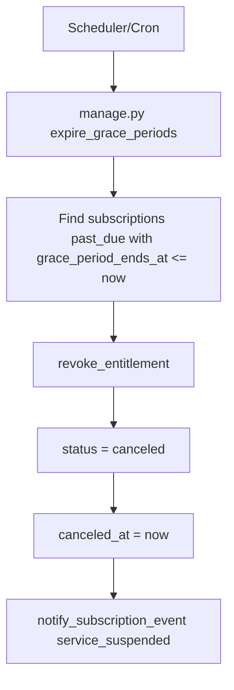
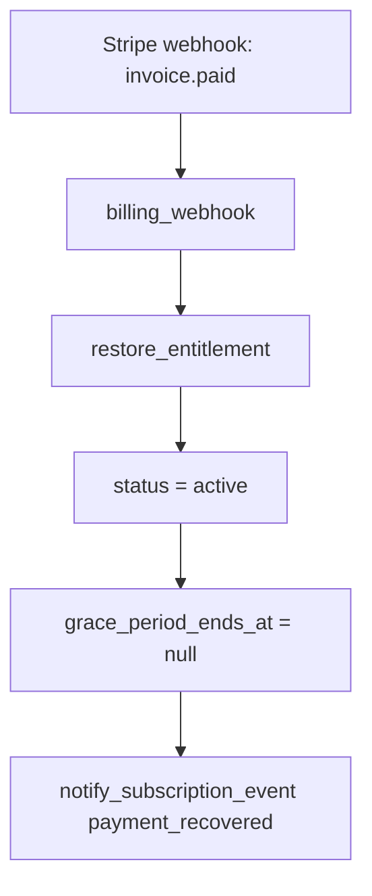
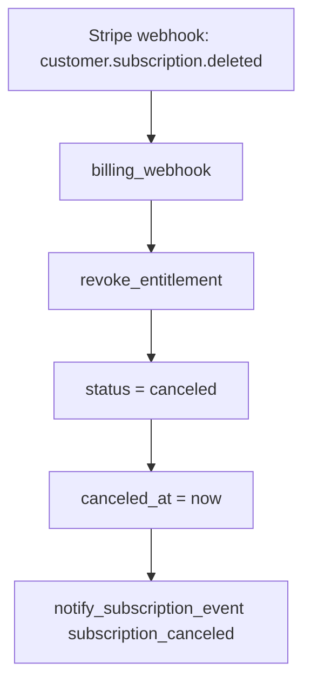

# CliniGraph AI Billing Guide

This document defines the billing architecture for multi-tenant healthcare organizations.

## 1. Billing Model (Recommended)

CliniGraph AI uses a hybrid model designed for clinics and hospitals:

1. Platform fee per tenant (organization baseline).
2. Seat-based overage by active users.
3. Usage-based overage by API volume.

This avoids weak billing proxies like number of computers and aligns billing with real platform value.

## 2. Why Hybrid Instead of Single-Metric Billing

Single-metric billing fails in healthcare SaaS:

1. Only seats:
   works for UI-heavy usage but underprices heavy automation and integrations.
2. Only API usage:
   creates invoice volatility and purchasing friction for enterprise contracts.
3. Only devices/computers:
   inaccurate and easy to bypass.

Hybrid keeps predictability for finance while preserving margin as usage grows.

## 3. Plan Schema in Backend

`SubscriptionPlan` now supports hybrid pricing fields:

1. `price_cents`: base platform fee.
2. `max_users`: included active users.
3. `max_monthly_requests`: included API requests.
4. `seat_price_cents`: overage price per active user above included threshold.
5. `api_overage_per_1000_cents`: overage per 1,000 API requests above included threshold.
6. `billing_model`: currently `hybrid`.

## 4. Active User Definition

Current operational definition:

1. Active users are counted from active tenant memberships.
2. This is a practical default until user-level activity telemetry is fully rolled out.

Future enhancement:

1. Count monthly active users by authenticated activity event stream.
2. Keep both values for reconciliation and audit.

## 5. Estimation Formula

For each tenant and active subscription plan:

1. `overage_users = max(active_users - included_users, 0)`
2. `overage_api_requests = max(api_requests - included_api_requests, 0)`
3. `api_blocks_1k = ceil(overage_api_requests / 1000)`
4. `users_overage_cents = overage_users * seat_price_cents`
5. `api_overage_cents = api_blocks_1k * api_overage_per_1000_cents`
6. `total_cents = platform_fee_cents + users_overage_cents + api_overage_cents`

## 6. API Endpoints

### Public Plans

`GET /api/v1/billing/plans/`

Returns hybrid plan metadata including included capacity and overage rates.

### Billing Estimate (Tenant Scoped)

`POST /api/v1/billing/estimate/`

Headers:

1. `Authorization: Bearer <token>`
2. `X-Tenant-ID: <tenant-uuid>`

Permission:

1. Tenant role must be `owner` or `admin`.

Optional payload overrides:

1. `active_users`: integer (simulate user growth).
2. `api_requests`: integer (simulate API growth).

If omitted, the estimator uses observed month-to-date usage records.

### Billing Invoice Close and Retrieval

1. `POST /api/v1/billing/invoices/close/`
2. `GET /api/v1/billing/invoices/`
3. `GET /api/v1/billing/invoices/<invoice_id>/`
4. `GET /api/v1/billing/invoices/<invoice_id>/receipt.txt`
5. `GET /api/v1/billing/invoices/<invoice_id>/receipt.pdf`
6. `GET /api/v1/billing/invoices/latest/`

Purpose:

1. Persist a monthly invoice snapshot per tenant and period.
2. Keep a durable billing record independent of runtime estimation.
3. Persist normalized line items for audit and finance reconciliation.

### Billing Usage Summary

1. `GET /api/v1/billing/usage/summary/`

Returns current period usage, included limits, overage, and latest invoice reference.

### Finance CSV Export

1. `GET /api/v1/billing/invoices/export.csv`

Purpose:

1. Export invoice-level financial data for accounting workflows.
2. Allow filtering by invoice status via query string.
3. Allow filtering by `currency`, `start_date`, `end_date`, `period_start`, and `period_end` (`YYYY-MM-DD`).

Supported query params:

1. `status`: draft/finalized/paid/void.
2. `currency`: ISO currency code (example `USD`).
3. `start_date`: include invoices generated on/after this date.
4. `end_date`: include invoices generated on/before this date.
5. `period_start`: include invoices whose billed period starts on/after this date.
6. `period_end`: include invoices whose billed period ends on/before this date.

### Stripe Customer Portal

1. `POST /api/v1/billing/portal/session/`

Creates a Stripe billing portal session for payment method and subscription self-service.

### Plan Change with Proration Preview

1. `POST /api/v1/billing/subscriptions/change-plan/`

Behavior:

1. computes proration preview,
2. optionally applies plan update (`apply=true`),
3. records event for billing audit.

## 7. Example Estimation Response

```json
{
  "tenant_id": "dcd13d2c-f893-4516-a69e-c6dcff7ac9de",
  "plan_code": "clinic-monthly",
  "currency": "USD",
  "billing_cycle": "monthly",
  "period_start": "2026-03-01T00:00:00+00:00",
  "period_end": "2026-04-01T00:00:00+00:00",
  "included_users": 25,
  "included_api_requests": 50000,
  "active_users": 31,
  "api_requests": 64020,
  "overage_users": 6,
  "overage_api_requests": 14020,
  "platform_fee_cents": 29900,
  "users_overage_cents": 11400,
  "api_overage_cents": 1350,
  "total_cents": 42650
}
```

## 8. Seeded Plan Strategy

Current seeded plans follow hybrid defaults:

1. `individual-monthly`
2. `clinic-monthly`
3. `hospital-annual`

Each includes:

1. base fee,
2. included user and API quota,
3. overage rates.

## 9. Operational Guidance

1. Use plan quotas as soft guardrails with alerts at 80% and 90%.
2. Keep hard-stop behavior configurable per contract.
3. Record usage with `metric=api.request` for billable request volume.
4. Keep invoice line items transparent: platform, seat overage, API overage.

## 10. Next Billing Milestones

1. Branded PDF template with legal/tax blocks.
2. Trial conversion and dunning workflows.
3. Tax/VAT support by region.
4. Revenue recognition and accounting export adapters.
5. Contract pricing tiers and committed-use discounts.

## 11. Entitlement Control and Grace Period

The platform now includes an entitlement lifecycle tied to payment events.

Policy:

1. `active` and `trialing` subscriptions have normal access.
2. `past_due` subscriptions keep temporary access during a grace window.
3. If the grace window ends without payment, service is suspended (`canceled`).
4. If payment is recovered (`invoice.paid`), entitlement is restored and grace is cleared.

Defaults:

1. `BILLING_GRACE_PERIOD_DAYS=7`.
2. `expire_grace_periods` command should run periodically (for example hourly).

### 11.1 Payment Failure to Grace Flow



### 11.2 Access Decision Flow



### 11.2.1 Enforcement in API Endpoints

The backend now enforces entitlement with HTTP `402` in tenant-scoped billing operations that require active service.

Protected with entitlement check:

1. `POST /api/v1/billing/estimate/`
2. `POST /api/v1/billing/invoices/close/`
3. `GET /api/v1/billing/invoices/`
4. `GET /api/v1/billing/invoices/latest/`
5. `GET /api/v1/billing/invoices/<invoice_id>/`
6. `GET /api/v1/billing/invoices/<invoice_id>/receipt.txt`
7. `GET /api/v1/billing/invoices/<invoice_id>/receipt.pdf`
8. `GET /api/v1/billing/invoices/export.csv`
9. `POST /api/v1/billing/subscriptions/change-plan/`

Recovery endpoints intentionally remain accessible when suspended:

1. `POST /api/v1/billing/portal/session/` (so tenant can update payment method)
2. `GET /api/v1/billing/usage/summary/` (so frontend can show suspension/grace state)

### 11.3 Grace Expiration to Suspension Flow



### 11.4 Recovery Flow



### 11.5 Explicit Cancellation Flow



## 12. Frontend Billing Dashboard

The React app now includes a billing cockpit section with:

1. Plan simulator (base fee + seat overage + API overage).
2. Tenant live usage summary retrieval (`JWT + X-Tenant-ID`).
3. Current estimate retrieval from tenant-protected billing estimate endpoint.
4. Direct invoice receipt download (TXT and PDF).
5. Tenant CSV export action for finance operations.
6. Visible export filters for status, currency, generated dates, and billed period dates.

This dashboard is designed as operational support and pricing transparency tooling.

It now also displays:

1. Live entitlement status (`active`, `trialing`, `past_due`, `canceled`, `incomplete`).
2. Grace deadline when the tenant is in `past_due` grace mode.
3. Service warning/suspension messaging with direct action to open Stripe Billing Portal.

## 13. Tenant Access Administration Screen

The frontend now includes a dedicated tenant access panel for user and role management.

Capabilities:

1. List tenant memberships.
2. Create or attach users with explicit tenant role.
3. Update role and activate/deactivate tenant membership.

API backing endpoints:

1. `GET /api/v1/tenants/memberships/`
2. `POST /api/v1/tenants/memberships/create/`
3. `PATCH /api/v1/tenants/memberships/{membership_id}/`

Authorization model:

1. Only tenant `owner` and `admin` can manage memberships.
2. The API blocks demotion or deactivation of the last active owner in a tenant.
