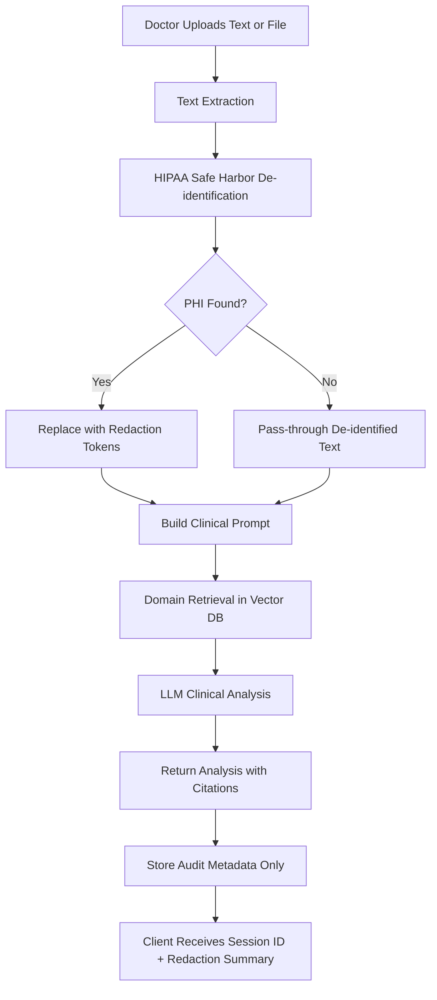
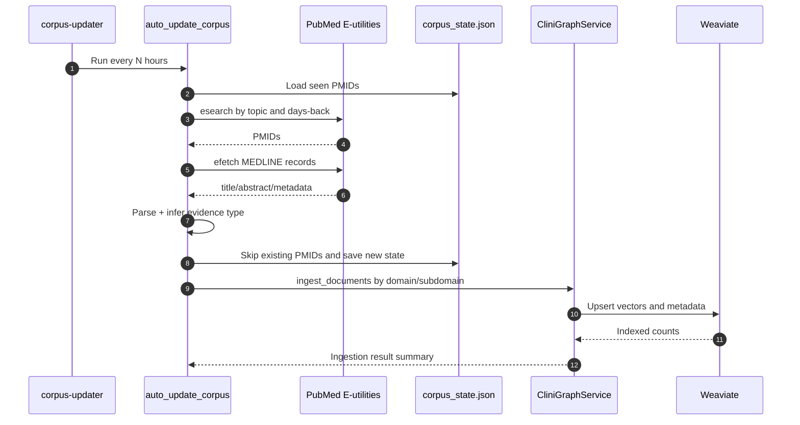
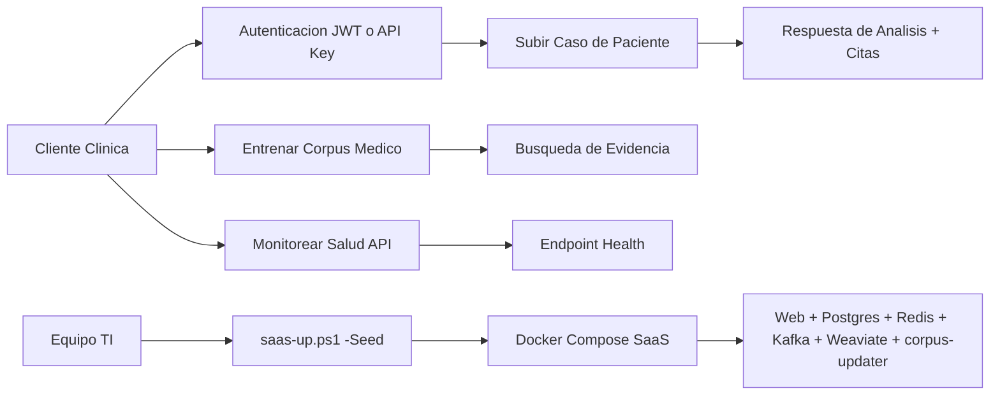

# CliniGraph AI - Client Usage Manual

This is the official living manual for client operations.

Policy for this file:

- This document must be updated whenever endpoints, flows, security controls, or deployment steps change.
- Product and operations teams should treat this file as the primary customer-facing runbook.

## 1. Platform Purpose

CliniGraph AI helps clinicians and medical teams:

- Upload or submit de-identified patient case information.
- Query evidence-based medical knowledge by specialty.
- Retrieve structured citations and supporting evidence.
- Keep the clinical corpus updated with scheduled PubMed ingestion.

## 2. Security and Compliance

### HIPAA handling in patient-case flow

Patient-case analysis applies automatic PHI de-identification before any AI inference.

Current controls:

1. Extract raw text from request payload (text or file).
2. Detect and redact PHI categories (Safe Harbor pattern set).
3. Build model prompt from de-identified content only.
4. Return analysis and redaction summary.
5. Persist audit metadata only. Raw PHI text is not stored.

Important note:

- Automated de-identification is best-effort and must be complemented by organizational compliance controls and human review where required.

## 3. Main API Flows

### 3.1 Patient case analysis

Endpoint:

- POST /api/v1/agent/patient/analyze/

Accepted payload:

- text (optional): free-text history/symptoms/labs.
- file (optional): .txt, .pdf, .docx, .csv, .json.
- domain (optional): cardiology, neurology, oncology, etc.
- subdomain (optional): focused specialty segment.
- question (optional): targeted clinical question.
- user_id (optional): requesting user identifier.

Response fields:

- session_id
- analysis
- citations
- redaction_summary
- domain
- safety_notice
- request_id



Interpretation:

- De-identification always happens before prompt generation.
- The response includes both analysis and traceability metadata.

### 3.2 Medical evidence query

Core endpoints:

- POST /api/v1/agent/medical/query/
- POST /api/v1/agent/medical/evidence/

Recommended use:

- Use query endpoint for narrative answers.
- Use evidence endpoint for structured citations and filters.

### 3.3 Domain ingestion and uploads

Core endpoints:

- POST /api/v1/agent/medical/train/
- POST /api/v1/agent/medical/upload/
- POST /api/v1/agent/oncology/train/
- POST /api/v1/agent/oncology/upload/

## 4. SaaS Operations

### 4.1 Start stack

PowerShell:

```powershell
.\scripts\saas-up.ps1 -Seed
```

This starts:

- web API
- postgres
- redis
- kafka
- weaviate
- corpus-updater

### 4.2 Automated corpus updater

The updater periodically refreshes domain knowledge from PubMed.



Required configuration:

- CORPUS_UPDATE_INTERVAL_HOURS
- NCBI_API_KEY

## 5. Authentication

Options:

- JWT bearer token.
- X-API-Key.

Token endpoints:

- POST /api/v1/auth/token/
- POST /api/v1/auth/token/refresh/

## 6. Health and Support Checks

Health endpoint:

- GET /api/v1/health/

OpenAPI docs:

- GET /api/docs/

Operational checklist:

1. Verify health endpoint returns status ok.
2. Validate auth flow.
3. Run a medical query and confirm citations are returned.
4. Run a patient-case analysis and review redaction summary.

## 7. End-user Operational Diagram



## 8. Change Log Policy for This Manual

Each future update should include:

- date
- feature changed
- affected endpoint(s)
- migration or deployment impact
- client action required

## 9. Documentation Maintenance Workflow

For every new feature or modification, update these docs together:

1. [README.md](../README.md) (global summary and links).
2. [AGENT_AI_README.md](AGENT_AI_README.md) (technical implementation details).
3. [MERMAID_DIAGRAMS.md](MERMAID_DIAGRAMS.md) (architecture and flow diagrams).
4. This client manual in Spanish: [CLIENT_MANUAL.md](CLIENT_MANUAL.md).
5. Client manual in English: [CLIENT_MANUAL_EN.md](CLIENT_MANUAL_EN.md).

Use the standard template:

- [DOC_UPDATE_TEMPLATE.md](DOC_UPDATE_TEMPLATE.md)
- [PLATFORM_ROADMAP.md](PLATFORM_ROADMAP.md)

## 10. Document Version History

| Version | Date       | Change Summary                                                                 | Affected Endpoints                                | Client Action Required |
|---------|------------|--------------------------------------------------------------------------------|---------------------------------------------------|------------------------|
| 1.0.0   | 2026-03-20 | Initial client manual with API, SaaS operations, HIPAA case flow, and diagrams | `/api/v1/agent/*`, `/api/v1/health/`, `/api/docs/` | No                     |
| 1.1.0   | 2026-03-20 | Added living-document policy, bilingual documentation links, and update workflow | Documentation only                                | No                     |
