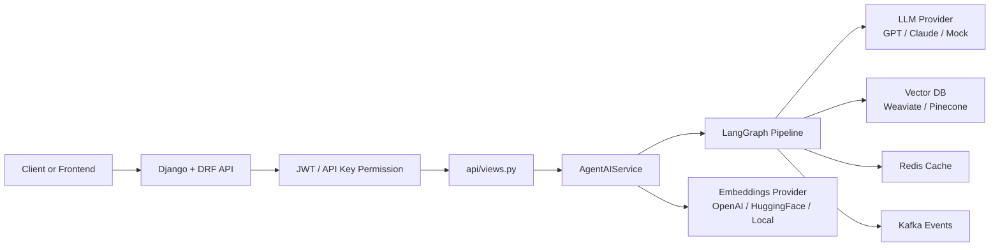
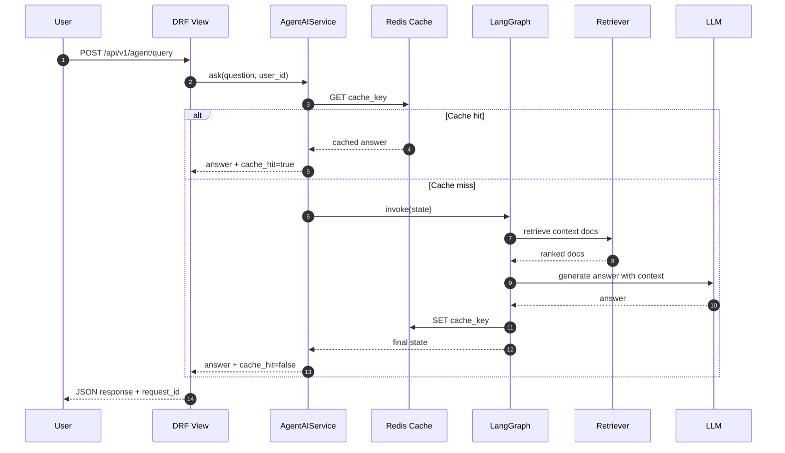
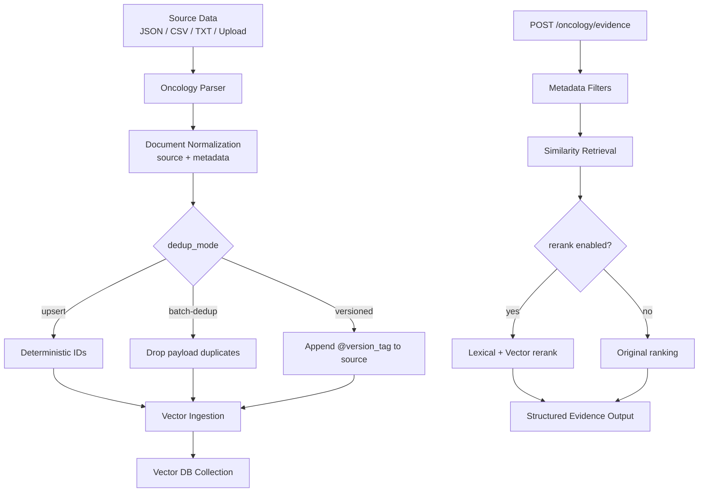
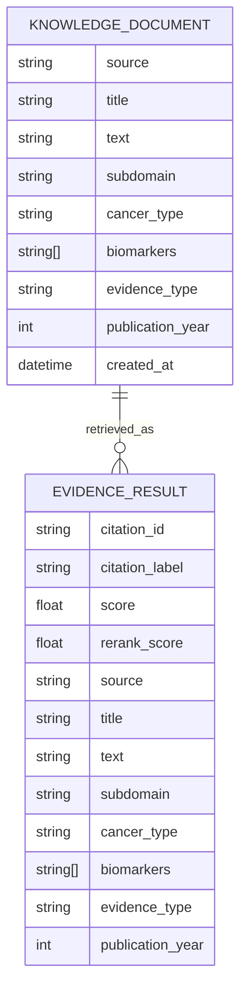
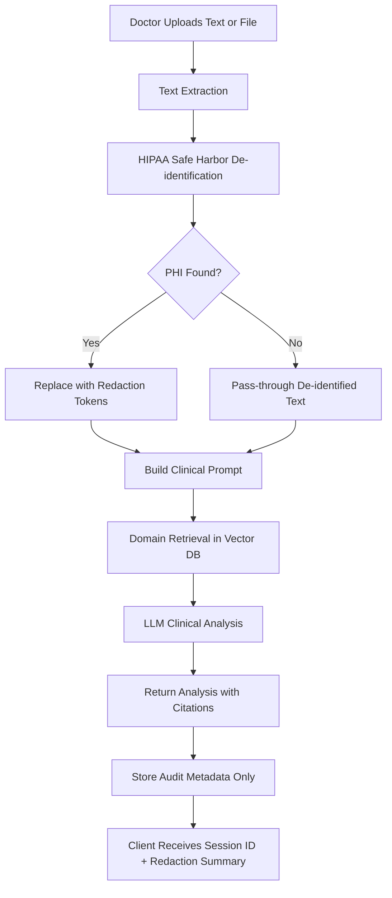
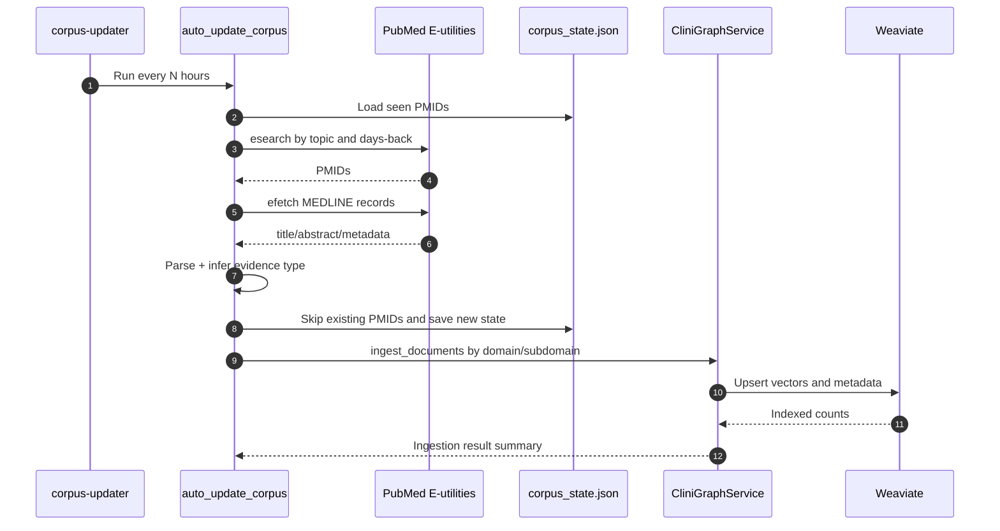

# AgentAI Mermaid Diagrams

This file visualizes the current system behavior and structure.

## How to Read These Diagrams

Recommended order:

1. Start with Runtime Architecture to understand the system components.
2. Continue with Agent Query Execution Flow to see request-time behavior.
3. Review Oncology Ingestion and Evidence Flow to understand domain-specific pipelines.
4. Finish with Data Model and Movement to map payload fields and output structure.

Interpretation tips:

- Boxes represent components or processing stages.
- Arrows represent request or data movement direction.
- Decision diamonds represent conditional logic (for example, dedup mode or rerank enabled).
- Sequence diagram participants are ordered by responsibility from API entrypoint to downstream services.
- ER entities describe the shape of stored/retrieved document metadata, not SQL tables.

## 1) Runtime Architecture

## 2) Agent Query Execution Flow

## 3) Oncology Ingestion and Evidence Flow

## 4) Data Model and Movement

## 5) Patient Case Analysis (HIPAA-safe)

This flow documents how uploaded patient information is processed safely before AI analysis.

Key controls:

- PHI is de-identified before LLM invocation.
- The API returns analysis plus citations and redaction summary.
- Audit persistence stores metadata only (no raw PHI text).

## 6) Automated Corpus Updater Runtime

This sequence diagram explains the periodic evidence refresh pipeline.

